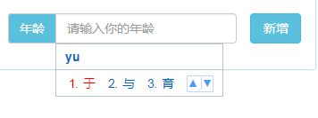
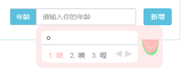
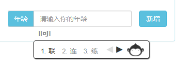
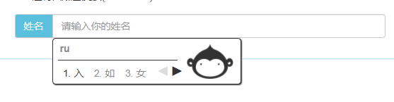
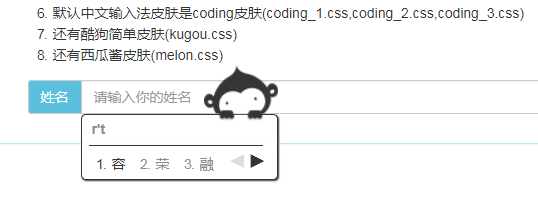

# visualKeyboard_Chinese--English

# 支持中文和英文输入的虚拟键盘项目

## 第一版 ---2017/03/05

支持中英文切换输入，中文连续联想功能，添加酷狗皮肤。

## 第二版 ---2017/10/26

添加西瓜皮肤

## 第三版 ---2018/02/02

添加coding皮肤

- coding皮肤一

- coding皮肤二

- coding皮肤二

欢迎大家fork阅读提问或者提出相关建议。